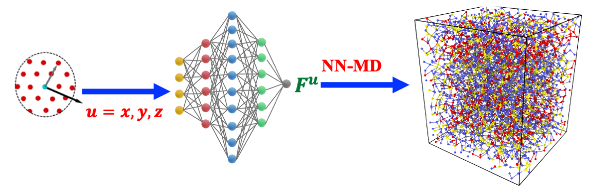

# Neural Network Molecular Dynamics at Scale
[P. Rajak, *et al.*, *Proceedings of IPDPS Workshop on Scalable Deep Learning over Parallel and Distributed Infrastructure*, ScaDL (2020)](https://ieeexplore.ieee.org/abstract/document/9150357)

We have developed a neural network (NN) based force field model for classical molecular dynamics dimulation of multi-component systems. The NN force field model is trained using  ab-initio MD simulations data to directly produce atomic forces at density functional theory (DFT) level accuracy. Special care is taken while designing the input feature vector of each atom representing its local environment such that feature vector is equivariant to rotation but invariant to translation and permulation. Equivariant to rotation of the feature vector is necessary beacuse the NN output which are atomic forces are vectors. The robustness of the NN force field model is validated by running MD simulation with the trained model and by comparing the structural properties of the system such as pair-correlation function, bond angle distribution and structure factor against the ground truth ab-initio MD.
